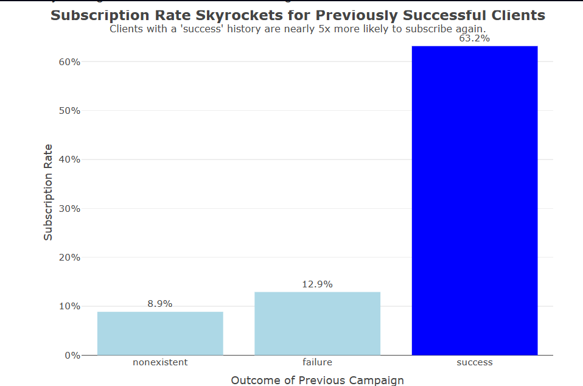
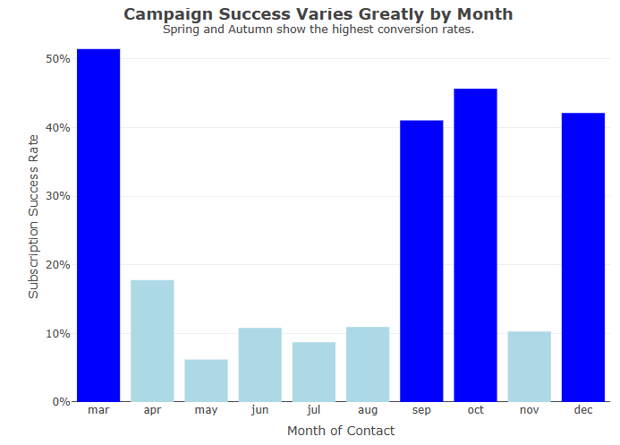

# Bank Marketing Campaign Performance Analysis 📈

This project was developed as part of my Data Mining & Visualization final project. Using a real-world bank marketing dataset containing 8,238 customer records, I evaluated the effectiveness of previous marketing campaigns and identified the factors most strongly associated with term deposit subscriptions.

Rather than focusing solely on statistical outputs, the project emphasized transforming data into actionable business recommendations that marketing teams could realistically implement.

## ✨ Project Overview

### Business Problem

Banks invest significant resources into marketing campaigns, yet customer response rates often vary dramatically across different customer segments and campaign periods.

The challenge is identifying:

* Which customers are most likely to subscribe
* Which campaign characteristics contribute to success
* How marketing resources can be allocated more efficiently

### Objective

Analyze customer and campaign data to uncover patterns that influence subscription outcomes and translate those findings into practical business strategies.

### Dataset

* 8,238 customer records
* Demographic information
* Financial attributes
* Previous campaign outcomes
* Contact methods
* Campaign timing information
* Subscription outcomes (target variable)

---

## 🔍 Development Process

### 1. Data Quality Assessment

* Evaluated missing values and data quality issues
* Applied variable-specific preprocessing techniques
* Justified preprocessing decisions based on data characteristics rather than following a fixed workflow

### 2. Relationship Analysis

Investigated relationships between campaign outcomes and key variables, including:

* Previous campaign outcome
* Contact method
* Call duration
* Campaign month

Statistical tests and exploratory analysis were used to identify meaningful patterns and significant relationships.

### 3. Data Storytelling & Visualization

Built interactive visualizations to communicate findings in a way that could support business decision-making rather than simply presenting statistical results.

---

## 📊 Key Findings

### Previous Success Predicts Future Success

Customers who previously subscribed during a marketing campaign achieved a **63.2% subscription rate**, making them over **4.5× more likely** to subscribe again than other customer groups.

### Campaign Timing Matters

Marketing performance varied substantially across months.

High-performing months included:

* March
* September
* October
* December

while months such as May generated large outreach volumes but relatively low conversion rates.

### Engagement Correlates With Success

Customers who subscribed had a median call duration of **439 seconds**, compared to **165 seconds** for those who did not subscribe, suggesting stronger engagement among successful conversions.

---

## 💡 Business Recommendations

### Target Previously Successful Customers

Create a dedicated high-priority customer segment consisting of clients with successful outcomes in previous campaigns.

Given their 63.2% conversion rate, this segment provides significantly higher expected returns than broad outreach strategies.

### Optimize Campaign Timing

Concentrate marketing resources during historically high-performing periods and reduce spending during months with consistently low conversion rates.

---

## 🛠️ Tech Stack

* R
* dplyr
* ggplot2
* plotly
* R Markdown

---

## 📁 Repository Contents

* Data preprocessing scripts
* Exploratory data analysis
* Statistical relationship analysis
* Interactive visualizations
* Business recommendations
* Final project report

---

## 🌟 What Made This Project Special

This was my first end-to-end analytics project and the one that changed how I think about data.

Before this project, I viewed data analysis mainly as generating charts and statistics. Through this experience, I learned that the real value comes from connecting those findings to business decisions and actionable recommendations.

---

## 🎯 Key Takeaway

Preprocessing is not just data cleaning—it is a series of decisions that shapes the quality of every insight generated from the data.
---
## 👩‍💻 Author

**Luna Alexa**

Data Science Student — BINUS University

